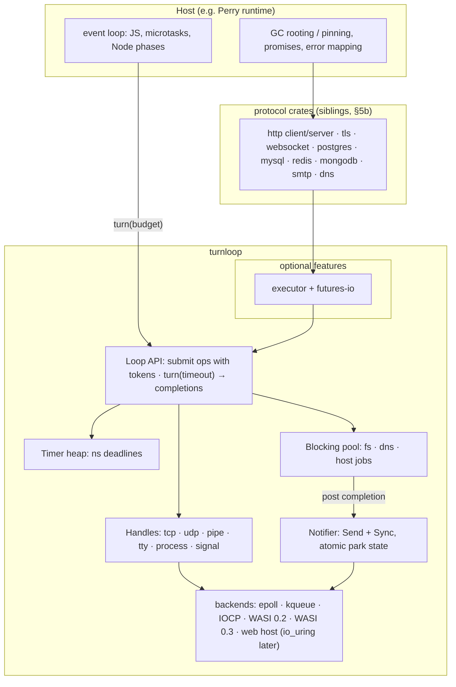

# turnloop: an embeddable, cross-platform event-loop driver

**Status:** draft 0.3 for review · 2026-09-14 (0.3: zero tokio, own HTTP/1.1 + HTTP/2; 0.2: tokio replaced everywhere with no sidecar; WASI and web in the first release; protocol layer added; multithreading model based on the `perry/thread` code map)\
**Name:** `turnloop` (chosen 2026-09-14; free on crates.io that day).\
**First consumer:** Perry, removing tokio from every target and every crate.\
**License / home:** MIT, a standalone repository, published to crates.io from day one.

turnloop is an event loop that someone else turns: the host program owns the loop and the thread, and calls `turn()` when it wants I/O, timers and wake-ups to make progress.

---

## 1. Summary

`turnloop` is a small, cross-platform I/O and timer driver built to be **embedded in a host's event loop**. It is not built to own the thread. It delivers the part of libuv that the Rust ecosystem lacks:

- **A bounded turn.** `turn(timeout)` does at most one OS wait and returns completions. It never runs user code.
- **A way to be woken from outside, on every platform:** a pollable fd on Unix, an event handle on Windows, and a cross-thread notifier that makes no syscall while the loop isn't parked.
- **Completion-shaped I/O,** implemented natively on Linux (epoll), macOS/BSD (kqueue), **Windows (IOCP), WASI 0.2/0.3 and the web (browser host)**, all from the first release.
- **Timers with sub-millisecond deadlines,** a blocking thread pool, child processes, signals, pipes and TTYs (where the platform has them).
- **Multithreading as a first-class use:** a loop per JS agent on any thread, per-loop routing, process-wide services that deliver per loop, handle transfer between loops and processes (§5a).
- **Optional layers:** a futures executor and futures-io traits. **No tokio sidecar, and zero tokio anywhere** (not even tokio's trait-only features). Crates that depend on tokio, which includes hyper and h2, are replaced through the protocol layer (§5b).

It knows nothing about JavaScript, garbage collection or Node's rules. Those stay in the host.

## 2. Why this exists

### 2.1 The problem is the fit, not tokio

Perry owns its event loop. Its generated `main` runs microtasks, timers and pumps, and parks in `js_wait_for_event` (`perry-runtime/src/event_pump.rs:544`). Tokio is plugged in through three hooks, `js_register_wait_driver(sleep, fast, wake)` (`event_pump.rs:131`). Tokio has no stable API to run its driver for one bounded step or to expose its OS handle, so Perry fakes a bounded wait:

- **`sleep`** runs `RUNTIME.block_on(async { EVENT_READY.notified(); timeout(max(budget, 1 ms), notified) })` (`perry-stdlib/src/common/async_bridge.rs:314`). Every loop turn builds and tears down a `block_on`, a `Notify` registration and a timer-wheel entry, and never waits less than 1 ms.
- **`fast`** does the same with a 1 ms timeout on every JS-work iteration while native work is pending (`async_bridge.rs:381`).
- **Several ext crates** (pg, mysql2, mongodb, ioredis, fetch, nodemailer, axios) hand each request to a blocking-pool thread that calls `Handle::current().block_on`.

These requests have been open upstream for years with no API:
- a single non-blocking tick ([tokio discussion #6651](https://github.com/tokio-rs/tokio/discussions/6651))
- a libuv-style backend fd for GUI and webview loops ([tokio issue #6994](https://github.com/tokio-rs/tokio/issues/6994), open since 2024-11)

Tokio is designed to own the thread. Deno fits that model because JS runs *inside* tokio. Node (libuv) and Bun fit the opposite model: the JS runtime owns the loop and the driver. Perry is architecturally Node/Bun-shaped and currently pays to be tokio-shaped.

### 2.2 Evidence so far

| Source | Finding |
|---|---|
| Our PoC (macOS, compiled TS, `poc/custom-reactor`) | A main-thread mio reactor behind the same hooks. Single-connection TCP echo 2.6× faster; setTimeout lateness 2.1 → 1.1 ms with a socket open. Binary −0.9 %, RSS −1.5 %. The echo gap traced to writes waiting for the next 1 ms tick. |
| Codex, isolated HTTP transport (macOS) | Moving fetch dispatch off the blocking pool: **−36.8 % instructions, −33.6 % peak RSS**. Hyper on a custom reactor vs lean tokio: a tie in steady state. |
| Codex, Perry-runtime harness (macOS, cgu=16) | Native deadlines −10…−21 % instructions, timer abort −18 %, serial HTTP −6.7 % (inside cgu=16 layout noise), executable −92 KiB. |
| Linux attribution (x86_64, cgu=1) | tokio + Perry's bridge = 5–14 % of user instructions in tokio-backed workloads. The irreducible embedding cost is about 2.5k user instructions per `block_on` turn (no bounded-turn API in tokio 1.53.1). Making turns cheaper alone *raised* user instructions 13.5 %, because Perry's per-turn pump and keep-alive scan (~5.9k) then ran more often. |
| Linux A/B (x86_64, cgu=1, controls ±0.2 %) | Custom reactor vs lean tokio (Codex harness): HTTP paths −4…−7 % user instructions; native timers −3.9 % (c32) / +6.1 % (c4096); abort +15 %; executable −60 KiB. Our compiled-TS PoC: TCP echo at 4 connections −37 % user instructions, 1 connection +11 %. **With a socket open, JS timers cost ~70× more in the PoC reactor: it busy-polled.** Perry truncates sub-ms deadlines to 0, and the reactor's fast hook then made zero-timeout epoll calls in a loop (37,607 turns for 50 timers). The macOS "timer lateness" win was this spin. |
| Real `fetch()` dispatch patch (Perry, tokio kept) | Moving `perry-ext-fetch` off the blocking pool: −11…−21 % instructions per 1 KiB request (almost all kernel), −30…−63 % peak RSS, threads 33/129 → 1. |

The conclusion both experiments share is that steady-state socket I/O costs about the same on tokio or a custom reactor. The waste is in the *embedding*: per-turn setup, 1 ms floors, blocking-pool handoffs, cross-thread wakes, and a timer wheel used where a deadline would do.

### 2.3 Why not an existing crate

| Crate | Close on | Why it isn't the answer |
|---|---|---|
| tokio 1.53 | Everything | Owns the thread; no bounded turn, no backend handle (§2.1) |
| calloop 0.14 | `dispatch(timeout)`, nestable fd, executor, async I/O | No Windows. Callbacks run inside `dispatch`, so the host doesn't control when user code runs |
| compio-driver 0.12 | `Proactor::poll(timeout)`, waker, fd; io_uring / IOCP / polling | Completion-based and close in spirit. No host-notification design for Windows GUI loops, no process/signal/TTY layer, own op model. **A candidate backend; evaluate in M1 (§14).** |
| polling 3.11 / mio 1.x | OS readiness, bounded wait, fd | OS layer only. On Windows both emulate readiness via AFD, which covers sockets but not named pipes, console or files |
| napi-async-runtime 0.2 | Host-driven turns for Node addons | Executor + timers only, no I/O |
| libuv (C) | The model we want | C, callback-driven, `uv_backend_fd` unsupported on Windows, needs FFI plus its own threading rules |

## 3. Goals and non-goals

**Goals**

1. **Host-embeddable.** A bounded `turn`, a per-platform "wake me" primitive, `next_deadline()`, and no hidden threads unless asked for.
2. **Every Perry target from the first release,** at equal tiers: Linux, macOS, Windows, WASI (0.2 and 0.3) and web. Same API where the platform allows (§7.6 lists what each platform lacks), same contract tests, required CI on all of them. FreeBSD best-effort through kqueue; iOS/tvOS/visionOS/watchOS through kqueue and Android through epoll.
3. **Predictable cost.** No heap allocation per operation in steady state, no syscall on the notifier fast path, at most one OS wait per turn, no fixed-interval ticks.
4. **Deterministic resource lifetimes.** Every submitted operation completes exactly once, including on cancel and close, so hosts with a GC know when to release roots.
5. **Portable semantics** for TCP, UDP, Unix sockets / named pipes, stdio pipes, TTY/console, child processes, signals, timers, file and DNS operations (pool-backed), and host blocking jobs.
6. **Multithreading.** Many loops on many threads, cross-thread wake-up and posting, and a shared blocking pool (§5a).
7. **tokio-free Perry.** Together with the protocol layer (§5b), `cargo tree -i tokio` is empty for every Perry target, with no exceptions, and a CI gate keeps it that way.
8. **Optional integration layers:** a futures executor and futures-io traits.
9. **No knowledge of the host.** No JS, GC or Node types. Errors are OS codes plus a portable kind.

**Non-goals (v0.x)**

- A drop-in clone of tokio's API.
- Protocol implementations *inside the core crate*. They live in sibling crates on top of it (§5b).
- io_uring in 0.1. The API is designed so it can be added as a Linux backend without changes.
- Embedded / `no_std` targets.

## 4. Architecture



Four layers:

1. **Backends:** thin per-platform code; the only `unsafe`-heavy part. Wraps `libc`/`rustix`, `windows-sys`, WASI bindings (0.2 `wasi:io/poll`, 0.3 component-model async) and web host imports.
2. **Core:** `Loop`, timers, notifier, handles, operation table, blocking pool. A `Loop` is bound to one thread; many loops can run on many threads (§5a).
3. **Optional integration:** executor and trait implementations. Each is a cargo feature, off by default.
4. **Protocol crates:** sibling crates that implement or wrap the protocols Perry exposes, on top of layers 2–3. Never in the core crate.

## 5. Core design decisions

### D1. Pull-based completions, no callbacks inside the driver

The host submits operations tagged with a `Token` (an opaque `u64`). `turn()` fills a host-provided `Completions` buffer and returns. The driver never calls into host code.

- **Why:**
  - The host decides when user code runs, so Perry keeps full control of Node phase ordering and microtask checkpoints.
  - No re-entrancy.
  - No closure allocation per operation.
  - It is the natural shape of IOCP and io_uring, and trivial to expose over FFI.
  - An async layer can be built on top (tokens → wakers). The reverse isn't true.
- **Cost:** hosts write a dispatch loop. Perry already has one: its pumps drain queues into promises.

### D2. Completion-shaped I/O on every platform

Operations say what to do ("read into this buffer", "write these bytes", "accept"), not "tell me when ready".

- **Windows:** native overlapped I/O through IOCP (`AcceptEx`, `ConnectEx`, `WSARecv`/`WSASend`, overlapped named pipes).
- **Unix:** readiness-driven *inside* `turn` (edge-triggered interest, non-blocking syscalls, readiness cached until `EAGAIN`), surfaced as completions.
- **Why:** a readiness-shaped core forces Windows to emulate readiness through AFD polling, which covers sockets only. Named pipes, console and files then need separate designs. That is how "Windows later" turns into a second architecture. libuv reached the same conclusion.

### D3. Buffer ownership that works with a moving GC

Two read modes and one write mode:

- **`ReadBuf::Provided(IoBufMut)`:** the host supplies memory with an `unsafe` contract: the pointer stays valid and unmoved until this operation's completion (or cancellation completion) is delivered.
- **`ReadBuf::Pooled`:** the driver picks a buffer from its pool at completion time. The completion carries a `BufLease` valid until the next `turn` or until released. On Windows, idle TCP reads use **zero-byte reads** (libuv's technique) so no buffer is tied up per idle socket.
- **`WriteBuf(IoBuf)`:** the same stability contract, or an owned `Vec<u8>`/`Bytes` moved in.

How Perry meets it: Buffer, ArrayBuffer and TypedArray bytes live inline in the **old arena and are marked non-movable** (`perry-runtime/src/buffer/header.rs:982–996`, `gc/types.rs:622, 637`). A raw byte pointer stays valid across collections as long as the object stays reachable. Perry roots the Buffer from submit to completion, which D4 makes deterministic. Strings and other movable values are copied into a pooled or owned buffer first.

### D4. Exactly-once completion and close semantics

- Every accepted operation produces **exactly one** completion: success, error, or `Cancelled`.
- `close(handle)` cancels outstanding operations. Each yields `Cancelled`, then the handle yields a final `Closed` completion; OS resources are released only after that.
- Multishot operations (`read_start`, `accept_start`, signal and timer repeats) produce a terminal completion when stopped.
- **Why:** Perry must know when to unroot a Buffer or unpin a promise. "Probably done" is how use-after-free bugs happen under a moving GC (see Perry issue #9552, cross-thread promises never pinned).

### D5. The notifier: wake without syscalls on the hot path

`Notifier: Send + Sync + Clone`. Its state is an atomic `RUNNING | PARKED | NOTIFIED`.

- `notify()` sets `NOTIFIED` and makes a syscall **only** if the loop is `PARKED`: `eventfd` write on Linux, `EVFILT_USER` on kqueue, `PostQueuedCompletionStatus` on Windows.
- Cross-thread producers (the blocking pool, the sidecar, host threads) post `(token, payload)` into a lock-free queue owned by the loop and then notify.
- Our PoC's reactor used this handshake and made 0 wake syscalls on the main-thread hot path. The state machine is model-checked with `loom`.

### D6. Timers inside the driver, with nanosecond deadlines

- A 4-ary heap (or `BTreeMap<(Instant, id)>`, chosen by benchmark in M1) with O(log n) insert and cancel. Cancelled entries are removed immediately, not tombstoned.
- `next_deadline()` is exposed so hosts can compose their own deadlines.
- Precision: Linux uses `epoll_pwait2` (ns timeout; fallback `timerfd` on kernels < 5.11); macOS uses `kevent` with a `timespec`; Windows is covered in §7.3.
- **Why:** Perry's JS timers today are three mutex-guarded `Vec`s scanned in full every tick (`timer.rs:48, 398, 1582`). Remaining time is truncated with `as_millis()` (`timer.rs:287, 1463`), so sub-millisecond waits read as 0 and the loop spins until a throttle trips (`event_pump.rs:599–625`). Perry can move its JS timers into this heap (§12, P3) or keep them and pass a budget to `turn`.

### D7. A bounded turn and host integration

```rust
pub enum Timeout { Now, After(Duration), Until(Instant), Forever }
```

`turn(timeout, &mut completions)`:

1. Computes the effective wait: `min(timeout, next_deadline)`, or zero if work is already queued (posts, blocking-pool results, synchronous or terminal completions). With queued work the native step is at most one nonblocking discovery poll, made only while native operations are pending and native output reserve is available; with no native operation pending it is skipped, so pure post/timer/terminal churn costs zero syscalls (§10 rule 3). Cached readiness runs inside the native step without an OS call.
2. Does **at most one** OS wait (`epoll_pwait2` / `kevent` / `GetQueuedCompletionStatusEx`): a blocking wait (positive or infinite timeout) only when no work is queued, otherwise at most the zero-timeout discovery poll of step 1.
3. On Unix, performs the ready I/O; on Windows, collects IOCP entries.
4. Expires timers.
5. Drains cross-thread posts.
6. Returns `TurnInfo { completions, waited, alive, os_waits, discovery_polls, zero_event_waits }`: blocking waits, zero-timeout discovery polls, and native calls of either kind that returned no native event.

There are two ways a host drives a loop:

- **The host blocks in `turn`** (Perry's model): the host calls `turn(budget)` where it would otherwise sleep.
- **The host has its own blocking wait** (GUI toolkits, libuv, other runtimes): call `loop.integration()`:
  - `Integration::Fd(RawFd)` on Unix: the epoll/kqueue fd becomes readable when `turn` has work. Add it to the host's poller along with `next_deadline()`.
  - `Integration::Event(HANDLE)` on Windows: an IOCP handle is **not** a waitable object (`MsgWaitForMultipleObjectsEx` can't wait on it, and libuv's `uv_backend_fd` is Unix-only). An opt-in helper thread blocks in `GetQueuedCompletionStatusEx`, moves entries to the loop's queue and signals an auto-reset event. The host waits on that event and calls `turn(Now)`.
  - `Integration::HostCallback` on the web (and any host that owns scheduling): turnloop calls a host-provided `schedule_turn()` when work arrives; the host calls `turn(Now)` (§7.5).
  - `Integration::RuntimeOwned` on WASI: the runtime schedules the component, and `turn` waits inside the WASI poll/async primitive (§7.4).

### D8. Blocking pool

- A bounded pool: default 4 threads, configurable, lazily started, shared per process or per loop (config).
- It runs file operations, DNS resolution and host-submitted `FnOnce() -> BlockingResult + Send` jobs, and completes through the notifier.
- Cancellation is best-effort: a job that has started runs to the end and completes as `Cancelled` if its cancel won the race.
- File I/O goes through the pool on every native platform in 0.x. io_uring and IOCP file I/O are later optimisations behind the same API.
  - **Typed requests** (`Loop::fs`: open, read, write, metadata, directories, namespace changes) use this one shared pool on Linux, macOS/BSD **and Windows**. Requests on one handle run FIFO; only the head is ever queued on the pool, and each accepted request reserves its queue slot, so a full queue rejects before acceptance and a queued successor always starts.
  - **Adopted descriptors** (stdio, `Detached::from_fd`/`from_handle`) keep their stream paths: reusable pool jobs on Unix, and one synchronous worker per handle on Windows. Such a handle may be a pipe or console whose read blocks indefinitely and cannot be cancelled from a shared thread; it must not occupy the pool. This is the only per-handle file worker.
  - **WASI** has no threads: requests run inside `turn`, bounded by its event budget, against `wasi:filesystem` preopens.

### D9. Optional layers

- **`executor`:** a `!Send` `LocalExecutor` that turns tokens into wakers, plus `futures-io` `AsyncRead`/`AsyncWrite` on handles, plus `Sleep`.
- **`rustls`:** an adapter on rustls's unbuffered API, which suits completion-shaped I/O.
- **No tokio sidecar.** An earlier draft proposed running tokio on its own thread for crates that call it by name. That is rejected: every such crate is replaced through the protocol layer (§5b), and tokio leaves Perry's dependency graph entirely.

## 5a. Multithreading

`perry/thread` is system-wide multithreading, so turnloop treats many JS-running threads as the normal case.

### What Perry does today (base `4945fc1f74`)

- **Threads and heaps:**
  - `parallelMap`/`parallelFilter` start scoped threads per call, one per chunk; `spawn` starts a detached thread per call. There is no pool (`perry-runtime/src/thread.rs:1132–1202, 1600`).
  - Each thread has its own arenas, GC, root-scanner registry and microtask queue, with no cross-thread stop-the-world (`arena/block.rs:1041`, `gc/roots.rs:110`).
  - Values cross by deep copy (`SerializedValue`); only `SharedArrayBuffer` is shared (`thread.rs:220–303`).
- **Workers have no event loop.** The compiler rejects `await` inside `perry/thread` closures (`perry-codegen/src/lower_call/native/mod.rs:227–259`). A `worker_threads` Worker runs its entry function, then blocks on an `mpsc` receive for messages (`perry-stdlib/src/worker_threads.rs:1246–1305`).
- **One process-wide wake path:** a single `NOTIFIED` flag, a single `PUMP` condvar and a single wait-driver slot (`event_pump.rs:189–231, 342–388`). There is no "wake *this* loop" primitive. Timers and thread results sit in global queues with owner tags (`timer.rs:48, 398`; `thread.rs:1779`).
- **Hazards that follow from that** (found by reading the code, not reproduced):
  - Worker timers are tagged as the primary agent, so the main loop can fire them.
  - `spawn_for_promise*` called from a worker puts its task on the main thread's tokio runtime, and whichever thread pumps next settles a worker-heap promise.
  - Any thread in `js_wait_for_event` clears the shared flag.
- **Many ad-hoc threads:**
  - 3 per child process (stdout, stderr, waiter)
  - 1 per dgram socket, 1 per stdin reader, pty threads, fs-watch poll threads, IPC readers, a signal-wake thread
  - 1 per `Atomics.waitAsync` call, 1 per N-API async work item, 1 per `postMessageToThread` ack
  - a cluster round-robin accept thread
  - an HTTP/2 server with its own tokio runtime on a pool thread
- **Cluster is multi-process:** `SO_REUSEPORT` binding (`net.rs:69–77`) or a primary accept thread passing fds with `SCM_RIGHTS` (`cluster_sched.rs:734–808`). Nothing is shared between threads in one process.
- **"Main thread" isn't always the process main thread:** it's a spawned thread under the iOS game loop (`ios_game_loop.rs:210`) and the `perry-native` thread on Android.
- **Web:** `perry/thread` uses a Web Worker pool, each worker with its own wasm memory, crossing values by structured clone, with no `SharedArrayBuffer`/Atomics (`perry-codegen-wasm/src/wasm_runtime.js:2256–2445`).

### Model

1. **One `Loop` per JS agent.** The main agent, every `worker_threads` Worker, and `perry/thread` workers once async is allowed there each own a `Loop`. A loop is created on, and bound to, its thread (`!Send`), which can be any thread. Nothing assumes the process main thread.
2. **Routing belongs to each loop.** Every loop has its own `Notifier` and a `Poster: Send + Sync + Clone` that delivers `(token, payload)` to exactly that loop. There are no global queues and no shared wake flag.
   - A completion is only ever delivered on the owning loop's thread, so a promise is always settled by the thread whose heap it lives on. That removes the hazards above by construction.
3. **Process-wide services, per-loop delivery:**
   - a shared blocking pool
   - one signal dispatcher (signals are process-global) that fans out to subscribed loops
   - one child-exit dispatcher where the OS forces it (SIGCHLD); pidfd, kqueue and Windows wait registrations are per loop
   - one `Atomics.waitAsync` waiter service: a single helper thread, not one per call, posting to the waiting loop
   
   Each completes on the loop that submitted.
4. **The ad-hoc threads become loop handles or pool jobs.** Child stdio, dgram, stdin, pty, fs-watch, IPC, signal wake, waitAsync, N-API async work and message acks all move off dedicated threads. The only exceptions are where the OS requires a thread: Windows non-overlapped stdio and console input (§7.3), and macOS FSEvents, which delivers on its own dispatch queue. Filesystem watches are loop handles: inotify on epoll, EVFILT_VNODE on kqueue, ReadDirectoryChangesW on the loop's IOCP.
5. **Handle transfer:**
   - **Between loops:** `Loop::detach(h) -> Detached` (`Send`) and `Loop::attach(Detached, token) -> Handle`. For sockets, pipes and servers across threads or workers, it cancels in-flight ops with the usual exactly-once completions before detaching.
   - **Between processes:** fd passing via `SCM_RIGHTS` on Unix and `WSADuplicateSocketW` / `DuplicateHandle` on Windows, exposed on pipe handles so `child.send(msg, handle)` and cluster round-robin can move sockets (today `emitter.rs:430` drops the handle).
   - **Out of turnloop entirely (host handoff):** the same `detach` followed by `Detached::into_fd()` on Unix, or `into_socket()` / `into_handle()` on Windows. This is Node's mid-stream `socket.upgradeToTLS` — PostgreSQL's `SSLRequest` hands a live, already-connected socket to a TLS layer — so the class of socket that *might* later be upgraded no longer has to choose its transport at creation. `detach` already proves quiescence, so the guarantee the host gets is total: no operation, no buffer, no registration, no completion, ever again, for that transport. Conversion restores what the backend changed on adoption (Unix status flags and termios, Windows console mode) and hands the descriptor over in the mode the loop held it: non-blocking for a loop-created socket.
     - **Windows:** a handle's IOCP association is permanent and inescapable. Windows cannot dissociate one, rejects a second `CreateIoCompletionPort` with `ERROR_INVALID_PARAMETER`, and neither `WSADuplicateSocketW` nor `DuplicateHandle` escapes it — both produce another descriptor for the *same* socket or file object, which is where the association lives. Quiescence makes it inert (no packet can ever arrive for it), and the receiving host drives the transport with synchronous/non-blocking Winsock calls or with overlapped calls whose `OVERLAPPED.hEvent` has its low-order bit set, which suppresses the completion packet. A named-pipe instance keeps `FILE_FLAG_OVERLAPPED`, so for a pipe the tagged-`hEvent` form is the only one. The route back to completion-port-driven I/O is `attach`: an imported association is exactly what the IOCP backend's overlapped-event routing exists for.
     - **WASI 0.2/0.3 and web:** `Unsupported`. A WASI socket is a component-model resource handle in the component's own table, not a descriptor, and there is no interface that hands one to the embedder; a browser resource is a host JS object. Neither has an identity a host could act on.
   - **Reporting only:** `Loop::raw_transport(h) -> RawTransport` reports a live transport's native identity for Node's `socket._handle.fd`. The loop keeps ownership; the value is valid until the handle is closed or detached, and is for reporting and read-only queries, never for I/O, closing, mode changes or registration elsewhere.
6. **Multi-threaded accept:**
   - **Kernel-balanced:** where the kernel balances load (`SO_REUSEPORT` on Linux/FreeBSD), each loop gets its own listener with `ListenOpts::reuse_port`.
   - **Everywhere else** (macOS doesn't balance, and on Windows a socket can join only one completion port): one accepting loop hands connections to other loops with `detach`/`attach`. The policy (round-robin, least-loaded) belongs to the host.
7. **Per-agent timers.** Each loop's timer heap belongs to its agent, which replaces Perry's owner-tagged global timer queues.
8. **Web:** a loop per Web Worker instance. Cross-worker posting goes through host `postMessage`. With cross-origin isolation, a `SharedArrayBuffer` ring plus `Atomics.notify` can back a `Poster` without message copies.
9. **Contract tests:**
   - N loops on N threads cross-posting under load
   - completions only on the owning thread (debug assertion)
   - detach/attach under in-flight I/O
   - reuse-port and accept-and-hand-off distribution
   - signal fan-out
   - `waitAsync` service fairness
   - a loop on a non-main thread (iOS/Android shape)

## 5b. Protocol layer: which protocols have to be implemented

Without a sidecar, every tokio-bound crate Perry uses has to be replaced. The rule: **use a sans-IO or runtime-agnostic protocol crate where a good one exists; implement the client or server logic ourselves on top of turnloop where none does.** Protocol code lives in sibling crates (in the turnloop repository, or as Perry ext crates), never in the core.

| Perry surface | Today (tokio-bound) | Replacement | Work |
|---|---|---|---|
| HTTP/1.1 + HTTP/2 server (`node:http`, fastify, framework) | hyper + hyper-util `server-auto` (tokio) | **own** HTTP/1.1 (on `httparse`) and HTTP/2 (own framing, flow control and HPACK) in `turnloop-http`, server side | **large** |
| HTTP client (`fetch`, axios, undici) | reqwest (tokio) | **own** HTTP/1.1 + HTTP/2 client in `turnloop-http`: pool, redirects, proxy, decompression | **large** |
| TLS | tokio-rustls | rustls unbuffered API adapter | small–medium |
| WebSocket (`ws`) | tokio-tungstenite | tungstenite protocol core over turnloop streams | small–medium |
| PostgreSQL (`pg`) | sqlx `runtime-tokio` | `postgres-protocol` (sans-IO messages, SCRAM) + own connection, pipeline and pool | **large** |
| MySQL (`mysql2`) | sqlx `runtime-tokio` | `mysql_common` (sans-IO packets, auth plugins, value codec) + own connection and pool | **large** |
| Redis (`ioredis`) | redis `tokio-comp` | RESP codec (`redis-protocol`) + own client: pipelining, pub/sub, reconnect; cluster/sentinel scoped separately | medium–large |
| MongoDB (`mongodb`) | official driver (tokio-only) | `bson` + own OP_MSG wire protocol, SCRAM auth, server discovery and monitoring, pool, TLS | **largest**; no sans-IO driver exists |
| SMTP (nodemailer) | lettre `tokio1` | lettre's runtime-agnostic message builder + own SMTP client on turnloop + rustls | small–medium |
| DNS | tokio blocking lookups | blocking pool `getaddrinfo`/`GetAddrInfoW`; `hickory-proto` for async/DoH later | small |
| child_process, container | `tokio::process` | turnloop processes | covered by core |
| cron | `tokio-cron-scheduler` (never referenced) | delete the dependency | trivial |
| Linux tray/MPRIS (gtk4: ksni, mpris via zbus) | zbus `tokio` feature | zbus's non-tokio mode runs its own small executor thread (async-io). Decide: accept for this Linux-desktop-only surface, or drive zbus on turnloop | decision |

**Zero tokio (decided 2026-09-14).** `hyper` 1.x has a mandatory `tokio` (`sync`) dependency, and `h2` needs `tokio` `io-util` plus `tokio-util`. So neither is used: HTTP/1.1 and HTTP/2 are implemented in `turnloop-http` (sans-IO, with `httparse` for HTTP/1 parsing and our own HPACK and HTTP/2 framing). `rustls` and `tungstenite` have no tokio dependency and are kept. CI fails if `tokio`, `tokio-util`, `async-std`, `smol` or any other async runtime crate appears in any target's dependency tree.

## 6. API sketch (non-normative)

```rust
pub struct Loop { /* !Send */ }
pub struct Handle(u32);                 // generational index
pub struct OpId(u64);
pub struct Token(pub u64);              // opaque to turnloop

impl Loop {
    pub fn new(cfg: Config) -> io::Result<Loop>;
    pub fn turn(&mut self, t: Timeout, out: &mut Completions) -> io::Result<TurnInfo>;
    pub fn next_deadline(&self) -> Option<Instant>;
    pub fn alive(&self) -> bool;               // any referenced handle, op or timer
    pub fn notifier(&self) -> Notifier;         // Send + Sync + Clone
    pub fn poster(&self) -> Poster;             // Send + Sync + Clone: post (token, payload) to THIS loop
    pub fn integration(&mut self) -> io::Result<Integration>; // Fd | Event | HostCallback | RuntimeOwned

    // multithreading and host handoff (§5a)
    pub fn detach(&mut self, h: Handle) -> io::Result<Detached>;          // Detached: Send
    pub fn attach(&mut self, d: Detached, tok: Token) -> io::Result<Handle>;
    pub fn send_handle(&mut self, pipe: Handle, h: Handle, tok: Token) -> io::Result<OpId>; // SCM_RIGHTS / DuplicateHandle
    pub fn raw_transport(&self, h: Handle) -> io::Result<RawTransport>;   // borrowed, reporting only: socket._handle.fd
    // and, on the transport a detach returned, ownership leaves for good:
    //   unix:    Detached::into_fd(self) -> OwnedFd
    //   windows: Detached::into_socket(self) -> io::Result<OwnedSocket>
    //            Detached::into_handle(self) -> io::Result<OwnedHandle>

    // timers
    pub fn timer(&mut self, at: Instant, repeat: Option<Duration>, tok: Token) -> Handle;
    pub fn timer_reset(&mut self, h: Handle, at: Instant) -> bool;

    // sockets and pipes
    pub fn tcp_connect(&mut self, addr: SocketAddr, o: &TcpOpts, tok: Token) -> io::Result<Handle>;
    pub fn tcp_listen(&mut self, addr: SocketAddr, o: &ListenOpts) -> io::Result<Handle>;
    pub fn udp_bind(&mut self, addr: SocketAddr, o: &UdpOpts) -> io::Result<Handle>;
    pub fn pipe_connect(&mut self, name: &PipeName, tok: Token) -> io::Result<Handle>; // AF_UNIX / named pipe
    pub fn pipe_listen(&mut self, name: &PipeName, o: &ListenOpts) -> io::Result<Handle>;
    pub fn open_stdio(&mut self, which: Stdio) -> io::Result<Handle>;                 // pipe, file or TTY/console
    pub fn tty_set_mode(&mut self, h: Handle, m: TtyMode) -> io::Result<()>;

    pub fn accept_start(&mut self, listener: Handle, tok: Token) -> io::Result<OpId>;  // multishot
    pub fn read(&mut self, h: Handle, b: ReadBuf, tok: Token) -> io::Result<OpId>;
    pub fn read_start(&mut self, h: Handle, tok: Token) -> io::Result<OpId>;         // multishot, pooled
    pub fn write(&mut self, h: Handle, b: WriteBuf, tok: Token) -> io::Result<OpId>;
    pub fn writev(&mut self, h: Handle, b: &mut [WriteBuf], tok: Token) -> io::Result<OpId>;
    pub fn send_to(&mut self, h: Handle, b: WriteBuf, to: SocketAddr, tok: Token) -> io::Result<OpId>;
    pub fn shutdown(&mut self, h: Handle, tok: Token) -> io::Result<OpId>;
    pub fn cancel(&mut self, op: OpId) -> bool;
    pub fn stop(&mut self, op: OpId) -> bool;                                        // end a multishot
    pub fn close(&mut self, h: Handle, tok: Token);
    pub fn set_ref(&mut self, h: Handle, referenced: bool);                           // Node ref/unref

    // processes and signals
    pub fn spawn(&mut self, spec: &ProcessSpec, tok: Token) -> io::Result<Process>;  // handles for stdio pipes
    // Node's stdio tail: extra child descriptors at fixed numbers (fork()'s IPC
    // channel at 3), their parent ends written into the caller's slice.
    pub fn spawn_extra(&mut self, spec: &ProcessSpec, tok: Token,
                       parents: &mut [Option<Handle>]) -> io::Result<Process>;
    pub fn kill(&mut self, p: Handle, sig: Signal) -> io::Result<()>;
    pub fn signal_start(&mut self, sig: Signal, tok: Token) -> io::Result<Handle>;

    // pool
    pub fn fs(&mut self, req: FsRequest, tok: Token) -> io::Result<OpId>;          // pool (native) or wasi:filesystem
    pub fn fs_watch(&mut self, path: &FsPath, o: WatchOptions, tok: Token) -> io::Result<Handle>; // multishot Watch
    pub fn resolve(&mut self, req: DnsRequest, tok: Token) -> OpId;
    pub fn blocking<F: FnOnce() -> BlockingResult + Send + 'static>(&mut self, f: F, tok: Token) -> OpId;
}

pub struct Completion { pub token: Token, pub op: OpId, pub result: OpResult }
pub enum OpResult {
    Connected, Accepted { conn: Handle, peer: SocketAddr },
    Read { n: usize, lease: Option<BufLease> }, Eof,
    Wrote(usize), RecvFrom { n: usize, from: SocketAddr, lease: Option<BufLease> },
    Timer, Signal(Signal), Exited(ExitStatus),
    Fs(FsResult), Watch { events: BufLease, overflow: bool },
    Resolved(DnsResult), Blocking(BlockingResult),
    Cancelled, Closed, Stopped, Err(Error),
}
pub struct Error { pub kind: ErrorKind, pub os: Option<i32> }   // host maps to ECONNRESET etc.

pub struct ChildFd { pub number: u32, pub source: ChildFdSource }   // number in 3..=MAX_CHILD_FD
pub enum ChildFdSource { Null, Pipe, Duplex, Handle(Handle) }       // Duplex is Node's 'pipe'/'ipc'
```

## 7. Platform design

### 7.1 Linux

- **Poller:** `epoll` (edge-triggered for sockets and pipes); `epoll_pwait2` for ns timeouts, with a `timerfd` fallback.
- **Wake:** `eventfd`.
- **Child exit:** `pidfd_open` (kernel ≥ 5.3) registered in epoll, falling back to a `SIGCHLD` self-pipe with `waitid(P_PID)` per child.
- **Signals:** a `sigaction` handler writing to a pipe or eventfd, installed only for signals the host subscribed to.
- **io_uring:** a later backend behind the same completion API. Not in 0.1.

### 7.2 macOS and BSD

- **Poller:** `kqueue` with `EV_CLEAR`; wake via `EVFILT_USER`.
- **Child exit:** `EVFILT_PROC NOTE_EXIT`.
- **Signals:** `EVFILT_SIGNAL` (with the handler set to ignore, so the default action doesn't fire).
- **Timeouts:** in the `kevent` `timespec`. `EVFILT_TIMER` isn't needed, since the heap owns deadlines.

### 7.3 Windows (first-class from 0.1)

- **Sockets:** one IOCP per loop. `FILE_SKIP_COMPLETION_PORT_ON_SUCCESS` via `SetFileCompletionNotificationModes` so synchronous successes don't round-trip through the port. `AcceptEx`/`ConnectEx`/`WSARecv`/`WSASend`/`WSARecvFrom`; zero-byte `WSARecv` for idle stream reads (D3).
- **Named pipes:** overlapped `ConnectNamedPipe`/`ReadFile`/`WriteFile`. This is the `pipe_listen`/`pipe_connect` transport (Node IPC uses named pipes on Windows).
- **Stdio that isn't overlapped** (a handle inherited as a synchronous pipe or file): a dedicated reader thread per handle that posts completions. It isn't possible to reopen such a handle overlapped. libuv does the same.
- **Console/TTY:** `ReadConsoleInputW` on a reader thread, with VT input and output modes (`ENABLE_VIRTUAL_TERMINAL_PROCESSING`/`_INPUT`). Resize events become a `Signal::WinCh` completion; Perry has no resize support on Windows today (`tty.rs:9–12`).
- **Processes:** `CreateProcessW` with overlapped pipe handles, a Job Object for kill-tree semantics, and `RegisterWaitForSingleObject` on the process handle to post the exit completion. Descriptors beyond stdin/stdout/stderr are published through the C run-time inherited-descriptor block in `STARTUPINFOW.lpReserved2` (count, per-descriptor flags from `GetFileType`, then the handles), plus `PROC_THREAD_ATTRIBUTE_HANDLE_LIST`. That is libuv's and Node's own convention, so a child descriptor number — `NODE_CHANNEL_FD=3` — means the same thing here as it does under Node. A child that does not use the C run-time inherits the handles but has no number for them.
- **Signals:** `SetConsoleCtrlHandler` for CTRL_C, CTRL_BREAK and CTRL_CLOSE, mapped to `SIGINT`/`SIGBREAK`/`SIGHUP`. SIGTERM has no console equivalent; documented as such, matching Perry today (`os/signal.rs:441–531`).
- **Wake:** `PostQueuedCompletionStatus` with a reserved completion key.
- **Timer precision:** the default system tick is about 15.6 ms and `GetQueuedCompletionStatusEx` timeouts round to it. Use a **high-resolution waitable timer** (`CREATE_WAITABLE_TIMER_HIGH_RESOLUTION`, Windows 10 1803+) armed to the next deadline and associated with the port through dynamically resolved `NtAssociateWaitCompletionPacket`. `GetQueuedCompletionStatusEx` is nonalertable. Cancellation returning `STATUS_PENDING` requires dequeuing the generation-tagged timer packet before reuse. M1 prototyped both APC and NT packet routes; §15 question 3 records the NT packet decision and measured lateness. `timeBeginPeriod` is not an acceptable default because it changes the tick system-wide.
- **Host integration:** `Integration::Event(HANDLE)` via the helper thread (D7).
- **Measuring cost:** there is no `perf`; use `QueryThreadCycleTime`/`QueryProcessCycleTime` (CPU cycles) for A/B comparisons.

### 7.4 WASI (first-class from 0.1)

Two backends, because both versions matter now:

- **WASI 0.2 (`wasm32-wasip2`, Rust tier 2).**
  - Readiness through `wasi:io/poll`: `poll(list<borrow<pollable>>)` is the single OS wait per turn.
  - Sockets through `wasi:sockets` (TCP/UDP create, bind, listen, connect, each exposing pollables); timeouts through `wasi:clocks/monotonic-clock` subscribe → pollable.
  - Outbound HTTP can go through `wasi:http/outgoing-handler`, so `fetch` doesn't need raw TCP on WASI.
  - Limits: no signals, no child processes, no TTY modes.
- **WASI 0.3 (released 2026-06-11; `wasm32-wasip3` approved for tier 2; Wasmtime 46+ enables it by default).**
  - `wasi:io` is gone; async moves into the component model (`async func`, `stream<T>`, `future<T>`).
  - The backend maps operations onto those futures and streams, and turns their resolution into completions. How a guest waits on several at once (the component-model async ABI's waitable sets) is an **M1 spike**.
  - `std::thread` isn't supported on 0.3 yet; cooperative threads are expected in 0.3.x.
- **Timer precision:** nanosecond deadline representation; wake precision is **host-dependent (Wasmtime ≈1 ms)**. Bare monotonic-clock waits reproduce the host lateness. The Wasmtime release contract uses median lateness ≤ 2 ms; debug builds exercise semantics and no-spin, not precision. No backend wait floor or busy-spin compensation is allowed. See [measurements](docs/wasm.md#wasi-timer-measurements).
- **Threads on WASI:** `wasm32-wasip1-threads` exists, but 0.2/0.3 are single-threaded today. The notifier degrades to a same-thread flag, and the blocking pool runs jobs inline or through host-provided async interfaces.
- **Host integration:** the host (Wasmtime or jco) owns scheduling. The guest's `turn(timeout)` blocks inside `poll` (0.2) or the component-model wait (0.3).
- **CI:** Wasmtime runs the contract tests for both, on every PR.

### 7.5 Web (browser host, Perry's `--target web` / `--target wasm`)

- **The event loop belongs to the browser.** `turn` never blocks on the main thread: only `Timeout::Now` is allowed there. A blocking `turn` is allowed only inside a Web Worker, where `Atomics.wait` is permitted.
- **Integration:** `Integration::HostCallback`. When a completion is posted (a JS callback firing), turnloop calls an imported `schedule_turn()`, which queues a macrotask or microtask in the host; the host then calls `turn(Now)`. Perry's `perry-wasm-host` provides the imports.
- **Backend = host imports:**
  - timers via `setTimeout`/`clearTimeout`, or the host's scheduler
  - HTTP via `fetch` with `AbortController`
  - WebSocket via the browser `WebSocket`
  - streams via `ReadableStream`/`WritableStream`
  
  Each import resolves by posting `(token, result)` into the loop.
- **Not available in browsers** and reported as `ErrorKind::Unsupported`: raw TCP/UDP, listening sockets, processes, signals, TTY, local filesystem (OPFS only where the host maps it).
- **Threads:** Web Workers + `SharedArrayBuffer` when cross-origin isolated. The notifier uses `Atomics.notify`; without isolation it's one loop per worker, communicating by `postMessage`.
- **CI:** headless-browser tests (`wasm-bindgen-test` with Chromium and Firefox) plus Node for the non-DOM subset.

### 7.6 Platform matrix

| Capability | Linux | macOS / BSD | Windows | WASI 0.2 | WASI 0.3 | Web |
|---|---|---|---|---|---|---|
| Wait / completions | epoll (io_uring later) | kqueue | IOCP | `wasi:io/poll` | component-model async | host callbacks |
| Wake | eventfd | EVFILT_USER | PostQueuedCompletionStatus | same-thread flag | same-thread flag | `schedule_turn` import / Atomics.notify |
| Timer wait precision | ns (epoll_pwait2 / timerfd) | ns (kevent timespec) | sub-ms via high-res waitable timer | host-dependent (Wasmtime ≈1 ms) | host-dependent (Wasmtime ≈1 ms) | host `setTimeout` (clamped by browser) |
| TCP / UDP | non-blocking + readiness | non-blocking + readiness | overlapped Winsock | `wasi:sockets` | `wasi:sockets` | unsupported |
| Socket options (§7.7) | full setsockopt set | full setsockopt set, no IPv4 membership by interface index | full Winsock set, no IPv4 membership by interface index | keep-alive, buffer sizes, hop limit | keep-alive, buffer sizes, hop limit | unsupported |
| Outbound HTTP | protocol crate | protocol crate | protocol crate | protocol crate or `wasi:http` | protocol crate or `wasi:http` | host `fetch` |
| WebSocket | protocol crate | protocol crate | protocol crate | protocol crate | protocol crate | host `WebSocket` |
| Local IPC | AF_UNIX | AF_UNIX | named pipes (overlapped) | unsupported | unsupported | `postMessage` |
| Descriptor handoff (§5a) | `Detached::into_fd` | `Detached::into_fd` | `into_socket`/`into_handle`; the IOCP association is permanent and inescapable, so synchronous calls or a tagged `hEvent` | unsupported (resource handle, not a descriptor) | unsupported (resource handle, not a descriptor) | unsupported (host object) |
| Native identity reporting (`_handle.fd`) | `RawTransport::Fd` | `RawTransport::Fd` | `RawTransport::Socket`/`Handle` | unsupported | unsupported | unsupported |
| Stdio pipes | readiness | readiness | overlapped, or reader thread | `wasi:cli` streams | `wasi:cli` streams | unsupported |
| TTY | termios + readiness | termios + readiness | console API reader thread, VT modes | size only | size only | unsupported |
| Child processes | pidfd / SIGCHLD | EVFILT_PROC | RegisterWaitForSingleObject + Job Object | unsupported | unsupported | unsupported |
| Child descriptors beyond stdio | one `pre_exec` `dup2` per number, sources relocated above every target first | same | C run-time inherited-descriptor block + handle-list attribute | unsupported | unsupported | unsupported |
| Child session control | `setsid` (`detached`), `setpgid` (`new_process_group`), `TIOCSCTTY` (`controlling_terminal`) | same | detached process group + Job Object; no controlling terminal | unsupported | unsupported | unsupported |
| Signals | sigaction + self-pipe | EVFILT_SIGNAL | SetConsoleCtrlHandler | unsupported | unsupported | unsupported |
| Files | blocking pool | blocking pool | blocking pool | `wasi:filesystem` preopens, run in `turn` | `wasi:filesystem` async preopens, run in `turn` | unsupported (no OPFS host mapping defined) |
| File watch | inotify (recursion by the host) | FSEvents for directories (recursive), kqueue for files | ReadDirectoryChangesW (recursive) | unsupported | unsupported | unsupported |
| DNS | pool (getaddrinfo) | pool (getaddrinfo) | pool (GetAddrInfoW) | `wasi:sockets/ip-name-lookup` | same | host (via fetch) |
| Host integration | epoll fd | kqueue fd | event HANDLE + helper thread | runtime-owned | runtime-owned | `HostCallback` |
| Cost measurement | perf instructions:u/k | rusage ri_instructions | QueryProcessCycleTime | Wasmtime fuel / instruction counts | Wasmtime fuel | browser profiler (relative) |

### 7.7 Socket options

Node exposes `socket.setNoDelay()`, `setKeepAlive()`, `setTTL()` and friends as
methods on a *connected* socket, and a server commonly configures every
connection it accepts, so a creation-time option struct cannot express what the
host needs. `Loop::set_option(handle, SocketOption)` and
`Loop::get_option(handle, SocketOptionKind)` are therefore part of the core API
and work on any live socket handle, including one produced by `accept`.

- **Synchronous, not an operation.** Both run entirely inside the call: no
  Request is accepted, no completion is produced, nothing is queued and nothing
  is allocated. They are the same shape as `tty_set_mode` and `local_addr`.
- **No cache, ever.** `get_option` always asks the OS, because the OS is entitled
  to round, clamp or double what it was given (`SO_RCVBUF` on Linux is the usual
  example). Reporting the request back would be a lie the host acts on.
- **`Unsupported`, never silently ignored.** A backend that has no equivalent for
  an option says so. "The option is on" is a latency and connection-lifetime
  claim; a host that cannot distinguish an applied option from an ignored one has
  no way to find the bug later. WASI 0.2/0.3 therefore refuse Nagle, linger,
  IPv6-only, broadcast and multicast, because `wasi:sockets` has no interface for
  them, and the web backend refuses all of them.
- **Bind-time options stay in the opts structs.** `SO_REUSEADDR`/`SO_REUSEPORT`
  cannot be changed on a bound socket, so they belong to `ListenOpts`/`UdpOpts`,
  not to `SocketOption`. `IPV6_V6ONLY` is readable on a live socket and kept in
  the enum for that, but setting it after bind is refused by every OS.
- **`ListenOpts::accept_defaults`** carries the per-connection defaults a server
  would otherwise apply by hand: `nodelay` and a keep-alive schedule, each at most
  one `setsockopt` on the new socket. The accepting backend applies them after the
  OS accept and **before** the `Accepted` completion is produced, so the host never
  observes an unconfigured connection. A backend that cannot apply a requested
  default rejects the *listener* when it is created, and an OS failure while
  applying one fails that accept rather than handing up a half-configured socket.

## 8. Loop liveness and ref/unref

- A handle, pending operation or timer is **referenced** by default. `set_ref(h, false)` excludes it from `alive()`, but it still produces completions while something else keeps the loop running.
- This is exactly Node's `ref()`/`unref()`. Perry implements it today in five places: timers (`timer.rs:916, 921`), dgram, child_process, ext-net (`option_setters.rs:60`) and the HTTP server. Bundled stdlib net has none (`net/mod.rs:1966–1974`). One mechanism replaces those.
- `alive()` is O(1): a counter maintained on submit, complete and ref changes.

## 9. What stays in the host (the Perry boundary)

| Concern | Owner | Notes |
|---|---|---|
| JS values, promises, callbacks | Perry | Tokens map to Perry-side records. Results convert to JS values on the main thread, as `spawn_for_promise_deferred` does today |
| GC rooting and pinning | Perry | Root Buffers and pin promises from submit to completion; exactly-once completion (D4) gives the release point. `gc_register_mutable_root_scanner` stays Perry's |
| Event-loop phase order | Perry | Today one iteration runs microtasks → timers and immediates in the same batch → nextTick → intervals → cron → all I/O pumps → park (`promise/microtasks.rs:1192–1221`), which is **not** Node's order. Moving to turnloop is the opportunity to implement timers → pending → poll (`turn`) → check → close; gated by gap tests |
| Microtasks, nextTick | Perry | unchanged |
| Error text and codes | Perry | Map `Error { kind, os }` to Node's `code`/`errno`/`syscall` |
| Keep-alive for JS-level resources | Perry | Uses turnloop `alive()` plus its own JS timers until those move (P3) |
| Child descriptor policy | Perry | Which number is the IPC channel, and the name and value of `NODE_CHANNEL_FD`; turnloop places the descriptor, never names it |
| Program resolution and shell | Perry | `shell: true`, `execPath`, PATH policy and argv construction |
| Pty allocation | Perry | `openpty` and its termios; turnloop owns only the child-side `setsid`/`TIOCSCTTY` through `ProcessSpec::controlling_terminal` |
| Reaping a child turnloop did not spawn | Perry | turnloop reaps only its own children, always by their own identity (`waitpid(pid, …)`, never `-1`), so a host waiter in the same process keeps its own children's status. There is no `adopt_process`; see `docs/lanes/procspec.md` |
| Thread-pool jobs touching JS | never | Pool jobs are `Send` Rust closures; results convert on the main thread |

**Wiring for P0:**
- Perry's `sleep(budget)` becomes `turn(Timeout::After(budget))`.
- `fast()` becomes `turn(Timeout::Now)` (and only if work is outstanding).
- `wake()` becomes `notifier.notify()`.
- The single stdlib deadline-provider slot (`lib.rs:409, 684`) becomes `next_deadline()`.

No other Perry change is needed for P0.

**perry-ffi async ABI:**
- Today's `spawn_async` / `spawn_blocking` / `run_pending` assume an ambient tokio `Handle` (`perry-ffi/src/async_runtime.rs:383, 431, 469, 82`), and ext crates call `Handle::current().block_on`.
- **v2** is token-based on turnloop:
  - `spawn_async` runs on the calling thread's loop executor
  - `spawn_blocking` goes to the shared pool
  - `run_pending` becomes a bounded `turn`
- **v1 signatures** are kept as shims over v2 where the semantics carry over. Ext crates that call `Handle::current().block_on` are rewritten onto the protocol crates (§5b); there is no tokio fallback.

## 10. Performance model and budgets

**Hard rules**, enforced by tests and CI benchmarks:

1. **Allocations:** zero heap allocations per read, write, timer or accept after warm-up (checked with a counting allocator in tests).
2. **Wake:** zero syscalls on `notify()` while the loop is running (checked with a syscall-counting harness: `strace -c` / `ktrace` / ETW in CI smoke tests).
3. **OS waits and discovery** (amended by tl-i01b, see the rationale below):
   1. A `turn` makes at most one OS wait.
   2. When completions are already queued, the turn performs **no blocking wait** (positive or infinite timeout).
   3. It may perform **at most one nonblocking native discovery poll** (zero timeout), and **only if native operations are pending** and native output reserve is available.
   4. With queued work and **no** native operations pending, the turn makes **no OS call at all**: pure post/timer/terminal churn costs zero syscalls.
   5. The no-spin rule (4a) is unchanged.

   *Queued work* means completions already queued before the native step: posts, blocking-pool and external-wait results, synchronous and terminal completions, including a timer's `Cancelled`/`Closed`; timer start, reset, cancel and close are therefore pure churn. A timer expiry that is due when the turn starts is not queued work: the effective wait is zero, so the turn may spend its one call on a zero-timeout poll. *Native operations* are operations submitted on native handles (sockets, pipes, files, processes, signals, web fetch/WebSocket), plus requests a backend accepts natively (WASI 0.2 DNS, and WASI filesystem requests, including path requests). Typed file requests on the native blocking pool are not native operations: their results arrive as queued work, like host blocking jobs. `TurnInfo::os_waits` counts blocking waits and `TurnInfo::discovery_polls` counts zero-timeout discovery polls; their sum is at most one per turn. Web callback draining and Windows Event-helper queue draining make neither kind of call. **Contract tests:** a queued post beside an idle UDP receive delivers with `os_waits == 0`, `discovery_polls == 1`, then byte-verified I/O; queued posts and timer `Cancelled`/`Closed` with no native operation record zero of both; a sustained producer keeps fresh I/O progressing within two seconds.
4. **Ticks:** no fixed-interval ticks and no minimum wait floor.
4a. **No spin.** A turn with nothing ready and a future deadline blocks until that deadline, at the precision in §7.6. It never returns immediately and never degrades into a zero-timeout poll loop. Hosts must pass exact deadlines (`Instant`, not truncated milliseconds). The Linux A/B measured what happens otherwise: 37,607 turns for 50 timers, ~70× user instructions. A backend whose timeout is implemented by a private wakeup source — epoll's timerfd, the IOCP deadline packet, the WASI 0.2 deadline pollable, the WASI 0.3 deadline subtask — reports that wake as a **zero-event** wait, exactly as a timed OS wait that returned nothing; real I/O or notifier events arriving in the same call still make it non-empty. **Contract tests:** with an idle registered socket and a 0.5 ms / 2 ms / 10 ms timer, turns per expiry ≤ 2 and zero-event OS waits ≤ 1 per expiry, on every backend; and (tl-i02) each of the sixty expiries at those delays costs exactly one blocking wait that observed no native event, identically with the loop idle and with a registered-but-idle native operation, with no allocation, while a call that carries real bytes is not counted empty.
5. **Instruction budgets per operation** (Linux, cgu=1, `perf stat -e instructions:u,instructions:k`): TCP read / write / accept, timer start + cancel, notify + turn round trip, blocking job round trip, idle turn. **Values to be set from the attribution run of today's tokio bridge**, with a target below the tokio-bridge cost and within X % of a hand-written epoll loop. The CI gate compares against a committed baseline, with a control probe that must not move.

**Rule 3 rationale (tl-i01b, spec-owner decision, 2026-09-15).** The original rule 3 ("none when completions are already queued") forbade even a zero-timeout poll. Backend revision 2 has no separate no-wait discovery primitive: `poll(Duration::ZERO)` is the only way to learn about fresh readiness or completions, and on Unix, after cached readiness reaches `EAGAIN`, only the poller marks a resource ready again. libuv and Node make the same trade: `uv_run` computes `uv_backend_timeout()`, which is zero while pending, idle or closing work exists, and still calls `uv__io_poll` with that zero timeout (see the libuv [loop API](https://docs.libuv.org/en/v1.x/loop.html) and [`src/unix/core.c`](https://github.com/libuv/libuv/blob/v1.x/src/unix/core.c)). The [tl-i01 probes](docs/lanes/tl-i01.md#evidence--specification-decision) showed that skipping discovery breaks the unchanged fairness contract: skipping the native step whenever work was queued failed the timer/I/O/post fairness test after two seconds, and a guard that only drained cached work delivered 64 posts with zero reads and failed the same fairness test. A separate no-wait collection API on all six backends is not justified before measurement. Rule 4a and its raw zero-event accounting are unchanged: an empty discovery poll still counts toward the same no-spin bound.

**Methodology** (lessons already paid for):
- Instruction A/Bs at `codegen-units=16` swing 0.5–8 % on untouched code, so gates build at cgu=1.
- Use interleaved fresh-process rounds, report [min, max], and include a control workload.
- A benchmark must assert its subject ran (counters > 0), not merely that nothing failed.

## 11. Testing and CI

- **Required CI** on every PR: Linux x86_64, Linux aarch64, macOS arm64, Windows x86_64; FreeBSD nightly. A public repo gets GitHub-hosted runners for free.
- **Contract tests** encoding what the host depends on, all run on all three OSes:
  - bounded `turn` honours its timeout (± scheduler noise)
  - `notify` from another thread wakes a parked turn
  - a notify while running makes no syscall
  - exactly-once completion under cancel, close and error
  - `close` ordering (`Cancelled`… then `Closed`)
  - ref/unref liveness
  - timer precision bounds per OS
  - `Integration::Fd`/`Event` wakes an external waiter
  - buffer-stability contract honoured (no access after completion)
- **Model checking:** `loom` for the notifier, the cross-thread queue and pool completion; Miri for the pure-Rust core where FFI permits.
- **Fault injection:** EINTR, partial writes, `EAGAIN` storms, ECONNRESET / WSAECONNRESET / WSAECONNABORTED, fd and handle exhaustion, a child that exits before registration, signal storms.
- **Leak checks:** open fd/handle counts and pool thread counts before and after every test.
- **Soak:** long-running echo, timer and process churn per OS, nightly.
- **Every configuration has a CI arm.** A feature flag or backend nobody runs is deleted, not kept (the rule Perry already applies to its GC knobs).

## 12. Perry migration plan

Each phase must pass all of these before it lands:
- Perry's gap suite (fast and auto-optimize tiers)
- GC stress with `PERRY_GC_SCHEDULE_SEED` + `PERRY_GC_PROTECT_FROMSPACE`, asserting collections landed while I/O was pending
- an instruction A/B at cgu=1 with a control probe
- a Windows CI arm

| Phase | Change | Removes |
|---|---|---|
| **P0** | turnloop behind the existing `js_register_wait_driver` hooks; timers stay in Perry, **but** Perry's deadline computation moves to `Instant` precision in the same change (today `as_millis()` truncation turns sub-ms waits into zero-budget spins), and the per-turn keep-alive scan becomes O(1) counters (the attribution run showed ~5.9k user instructions per turn there) | `block_on` + `Notify` + timeout per turn, 1 ms floors, spin on sub-ms deadlines |
| **P1** | net (bundled stdlib and perry-ext-net, including Windows named-pipe IPC) on turnloop handles | tokio net tasks, mpsc-per-write |
| **P2** | child_process, pty, stdin, dgram and signals on turnloop | per-pipe reader threads and polling readers (`os_process_streams.rs:361`, `dgram_reactor.rs:73`) on Unix; Windows keeps reader threads only where the OS requires them |
| **P3** | JS timers into the turnloop heap; Node phase order | Vec scans, ms truncation, spin-until-throttle |
| **P4** | blocking pool for bcrypt, argon2, sharp, zlib and crypto; perry-ffi ABI v2 | tokio `spawn_blocking` |
| **P5** | HTTP server (`turnloop-http` server side), TLS (rustls adapter) and WebSocket (tungstenite) on turnloop | hyper, hyper-util, tokio-rustls, tokio-tungstenite |
| **P6** | HTTP client replacing reqwest (fetch, axios, undici); SMTP client replacing lettre's tokio transport | reqwest, lettre tokio |
| **P7** | Database clients: Postgres, MySQL, Redis, MongoDB on the protocol crates (§5b) | sqlx, redis tokio-comp, mongodb driver |
| **P8** | Remove `async-runtime` / tokio from perry-stdlib, perry-ffi and every ext crate; web and WASI targets use the same stdlib paths through their backends; CI gate: `cargo tree -i tokio` is empty for every target | tokio |

P5–P7 are independent of each other once P1 and P4 have landed, and can run as parallel lanes.

## 13. Release, versioning and supply chain

- **Repository:** `github.com/PerryTS/turnloop`, standalone under the PerryTS GitHub org, MIT, with `SECURITY.md`. Releases go to crates.io through **Trusted Publishing** (GitHub OIDC), so there are no long-lived tokens.
- **Versioning:** `0.x` while Perry is the only consumer; breaking changes bump the minor version. Perry pins `turnloop = "=0.x.y"`.
- **Soak policy:** Perry's `.cargo/config.toml` sets `global-min-publish-age = "7 days"`, which would hide every new release for a week. **Standing policy: follow the perex precedent** (`1febaef5e0`, perex 0.1.4) on every turnloop bump:
  1. lock the new version with a one-time publish-age override
  2. verify the `.crate` checksum against the downloaded crate
  3. record the publish timestamp, source commit and checksum in the commit message
- **Dependencies:**
  - Core depends only on `libc`/`rustix` (Unix), `windows-sys` (Windows), the WASI bindings (`wasi` / `wit-bindgen`) and `wasm-bindgen`/`js-sys` for the web backend, each behind its target cfg.
  - Integration features pull their own crates (`futures-io`, `rustls`) and are off by default.
  - No crate in the turnloop repository depends on `tokio`, `hyper`, `h2` or any async runtime.

## 14. Milestones

| Milestone | Scope | Exit criteria |
|---|---|---|
| **M0** | This document reviewed; name chosen; repository and CI skeleton on Linux, macOS, Windows, WASI 0.2/0.3 (Wasmtime), web (headless browsers) | Sign-off on D1–D9, §5a, §5b |
| **M1** | Core: `Loop`, `turn`, notifier, timers, integration primitives on **all six backends**. **Spikes:** compio-driver as the IOCP/io_uring backend vs our own; Windows high-res timer approach; WASI 0.3 multi-wait mechanism; heap vs BTreeMap | Contract tests green on all targets; instruction baseline for idle turn, notify and timers; spike decisions written up |
| **M2** | TCP, UDP, pipes and named pipes, stdio; buffer modes; close and cancel semantics; multi-loop and cross-thread posting | Echo, IPC and multi-thread contract tests; zero-alloc and zero-wake-syscall gates |
| **M3** | Processes, signals, TTY/console; blocking pool (fs, DNS, jobs) | Process, signal and pool suites where the platform supports them |
| **M4** | Executor, futures-io; TLS and WebSocket crates; HTTP/1.1 and HTTP/2 cores | HTTP client and server interop tests (curl, Node) on the loop; TLS and WebSocket interop tests |
| **M5** | Perry P0 + P1 | Perry gates (§12) |
| **M6** | HTTP client; SMTP | fetch/axios parity suites |
| **M7** | Postgres, MySQL, Redis, MongoDB clients | driver conformance suites against real servers in CI |
| **M8** | Perry P2 → P8; tokio removed | `cargo tree -i tokio` gate green on every target |

## 15. Open questions

1. **Name.** Settled: `turnloop`.
2. **`sys` layer.** Own thin backends vs building on compio-driver (IOCP and io_uring already done) vs `polling`/mio for Unix. Decided in M1 with instruction numbers.
3. **Windows timer mechanism.** Use a high-resolution waitable timer with dynamically resolved `NtAssociateWaitCompletionPacket` and nonalertable GQCSEx. Windows 11 build 26200 rejected high-resolution APC callbacks with error 87; 100 NT-packet samples at 250 us measured p50/p95/max lateness of 275.2/285.8/380.9 us. See [the Windows results](spikes/iocp/WINDOWS_RESULTS.md); minimum-version and VM precision validation remain separate work.
4. **Pooled buffer sizing and lease lifetime.** Until the next `turn`, or explicit release only?
5. **io_uring timing.** When, and whether as the default where available.
6. **Mobile CI.** iOS (kqueue) and Android (epoll) come almost free from the Unix backends. Which simulators/emulators run in CI.
7. **DNS.** `getaddrinfo` on the pool is correct but coarse. Whether `hickory-proto` is in scope for 0.x.
8. **Where protocol crates live.** In the turnloop repository as siblings, or as Perry ext crates.
9. ~~The h2 / tokio `io-util` question~~: decided, zero tokio (§5b).
10. **zbus for the Linux tray/MPRIS surface** (§5b).
11. **Async inside `perry/thread` workers.** The compiler forbids it today. With a loop per agent it becomes possible; whether and when Perry allows it is a language decision.
12. **Maintenance ownership** and issue policy once external users appear.

## Appendix A: references

- Perry event-loop contract (base `4945fc1f74`): `perry-runtime/src/event_pump.rs:131, 342, 544–684`; `perry-stdlib/src/common/async_bridge.rs:137, 314, 350, 365, 381`; `perry-runtime/src/timer.rs`; `perry-runtime/src/buffer/header.rs:982–996`; `perry-runtime/src/gc/types.rs:622, 637`; `perry-ffi/src/async_runtime.rs`.
- Experiments: `poc/custom-reactor` (`poc/tokio-replacement/REPORT.md`); `experiment/tokio-custom-20260914` (`experiments/perry-reactor-parity/REPORT.md`, `experiments/tokio-custom/REPORT.md`).
- tokio: [discussion #6651](https://github.com/tokio-rs/tokio/discussions/6651), [issue #6994](https://github.com/tokio-rs/tokio/issues/6994), [runtime docs 1.53](https://docs.rs/tokio/latest/tokio/runtime/index.html).
- libuv: [loop API (`uv_backend_fd`, `uv_backend_timeout`)](https://docs.libuv.org/en/v1.x/loop.html).
- Related crates: [calloop](https://docs.rs/calloop/latest/calloop/), [compio-driver](https://docs.rs/compio-driver/latest/compio_driver/struct.Proactor.html), [polling](https://docs.rs/polling/latest/polling/struct.Poller.html), [napi-async-runtime](https://docs.rs/napi-async-runtime/latest/napi_async_runtime/), [async-compat](https://docs.rs/async-compat/latest/async_compat/).
